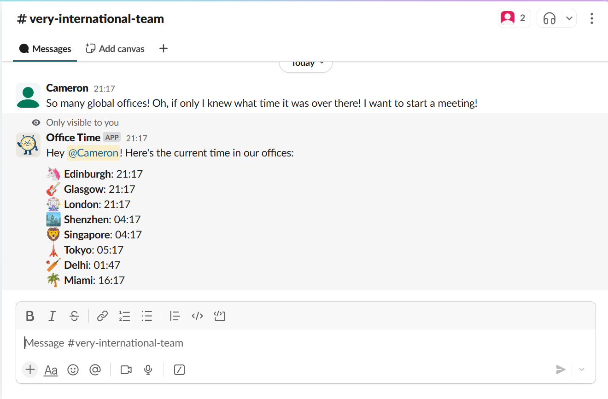

# OfficeTime Slack Bot 🕒

**OfficeTime** is a lightweight Slack bot that responds to the `/officetime` command by showing current local times across key office locations to the user silently. Requires no external API calls, making commands efficient.

It uses Python, Slack Bolt, and emoji-based city icons. Currently, Websocket (persistent) based slack app is supported. (TBA)

---

## Features

- Slash command `/officetime`
- Timezone-aware via Python’s `zoneinfo`
- Emoji-themed output for each city
- Ephemeral messages (only shown to you)
- Customisable list of cities and emojis

---

## Required scopes (Set these in Slack Admin App Permissions)

Required scopes:
- commands – to register /officetime
- chat:write – to send ephemeral messages

Enable Slash command in app permision
- Command: set to /officetime

## Common Issues
- Ensure that pytho module dependencies are installed
- Ensure that bot and app tokens match on slack admin
- Ensure /slashcommand in app permissions is to 'officetime' to enable app

## Upcoming

- Creation of App Manifest file for easy app creation (Easy setup)
- Http based client server based version - command on requests (Serverless)
